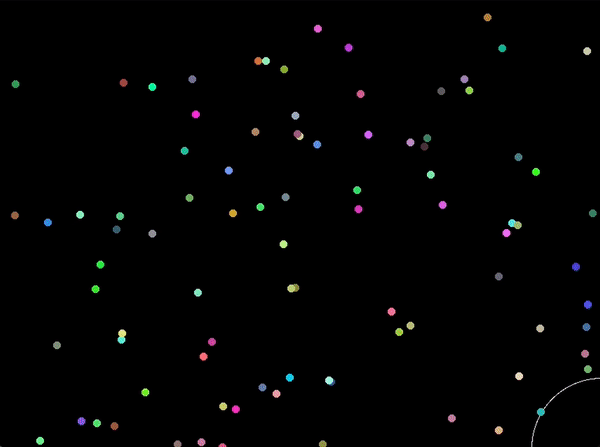

# Evolution Simulator 🪲🧬

*This project is still in alpha stages of development* ⚙️📝🧑‍💻 \
*Updates coming soon...*

## Project description
As the name suggests, this is a simple evolution simulator that runs on C++ and SDL2 I basically created this project to start learning neural nets.

## Creatures
The evolution is represented by some creatures (currently represented by colourful circles) that are seemingly moving randomly at first. Their "brain" is a simple neural net consisting of three layers of neurons and connections between them.

- **DNA** \
 The creature's brain is defined by its DNA. It's an array of numbers (the longer the array, the smarter the creature; currently it contains 50 numbers) between 0 and 65535 (`65535 = 2^15 + 2^14 + ... + 2^2 + 2^1 + 2^0`). Each of these numbers is of the form (in binary): `sSSSdDDDwwwwwwww`, where these bits represent:
   - `s` ... source type (input neuron or internal neuron)
   - `SSS` ... ID of the source neuron
   - `d` ... destination type (output neuron or internal neuron)
   - `DDD` ... ID of the destination neuron
   - `wwwwwwww` ... the connection weight
  
    The brain of the creature is then built using this DNA.

- **Input neurons** \
 The current input neurons consist of an oscillator, their age and a random number generator, therefore they are not aware of their environment in this stage of development. I'm planning on adding input neurons for detecting other creatures around them, remembering their last move and more.

 - **Output neurons** \
The current output neurons consist of a move in the X axis, a move in the Y axis, a move in a random direction and a change of the oscillator period. In the future I'm planning to add output neurons for attacking other creatures, changing the fertility and more.

- **Reproduction**\
Currently two creatures reproduce randomly if they get close to eachother. In the future I will add more complex mating criteria. The child of two creatures inherits some genes from one parent and some genes from the other.

- **Death**\
The creatures can currently die of old age. The chance of death gets higher as they get older. \
They can also die if they enter the "kill zone" which is the white circle in the bottom right corner.

## Example
The evolution doesn't always succeed, but when it does, we can get some interesting results, even in this early stage of development. In the following example you can see a few creatures reproducing and staying alive longer than others just above the kill zone.

## Want to try this project out?
- Clone this repository and move into the folder with your favourite terminal emulator
- Compile using `make EvolutionSimulator`
- Run using `./src/EvolutionSimulator.out`

## References
This project was inspired by [this video](https://www.youtube.com/watch?v=N3tRFayqVtk&list=WL&index=20)\
[Helpful tutorial](https://www.youtube.com/watch?v=sK9AbJ4P8ao) on neural nets in C++\
[Functions for drawing circles in SDL](https://gist.github.com/Gumichan01/332c26f6197a432db91cc4327fcabb1c)